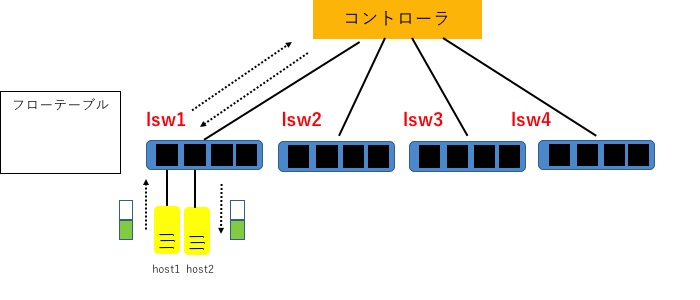
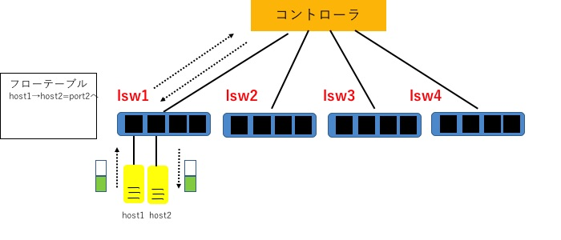
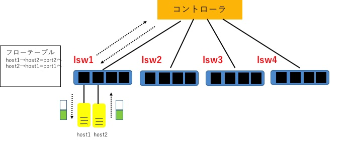

#課題内容

```
複数スイッチに対応したラーニングスイッチ (multi_learning_switch.rb) の動作を説明しよう。

複数スイッチの FDB をどのように実現しているか、コードと動作を解説する
動作の様子やフローテーブルの内容もステップごとに確認すること
必要に応じて図解すること。
```

##解答
```multi_learning_switch.rb``` 内で行われる動作について,順を追って下記に示す.  

###ステップ1
初めに,起動時に呼ばれる ```start``` ハンドラと,コントローラにスイッチが接続された際に呼ばれる ```switch_ready``` ハンドラについて説明する.

```
  def start(_argv)
    @fdbs = {}
    logger.info 'MultiLearningSwitch started.'
  end

  def switch_ready(datapath_id)
    @fdbs[datapath_id] = FDB.new
  end
```

ここでは, ```start``` ハンドラ内で定義されたハッシュ ```@fdbs = {}``` を用いて, ```switch_ready``` ハンドラ内でFDBのインスタンス変数を作成している. 一つのスイッチに接続されたホスト間の送受信について扱う場合と比較して, 複数のスイッチを扱う今回の場合は ```datapath_id``` をキーとしたハッシュを用いてインスタンス変数を作成する. これにより,新しいスイッチが接続された際に新たなFDBを作成することができる.  

###ステップ2  
次に,  ```Packet In``` ハンドラについて説明する.

```
  def packet_in(datapath_id, message)
    return if message.destination_mac.reserved?
    @fdbs.fetch(datapath_id).learn(message.source_mac, message.in_port)
    flow_mod_and_packet_out message
  end
```

ここでは,まず ``` return if message.destination_mac.reserved?``` において,既に予約されているMACアドレスが搭載されたパケットを受信した場合は,Packet Inせずに ```return``` する処理を行う.
```@fdbs.fetch(datapath_id).learn(message.source_mac, message.in_port)``` では, ```datapath_id``` で指定されたスイッチに対して ```learn``` メソッドを用いて送信元MACアドレスとパケットが入ってきたポート番号を学習させ, FDBに保存する. その後, ```flow_mod_and_packet_out``` メソッドを呼ぶ. 

###ステップ3
続いて, ステップ2において呼び出された ```flow_mod_and_packet_out``` ハンドラについて説明する.

```
  def flow_mod_and_packet_out(message)
    port_no = @fdbs.fetch(message.dpid).lookup(message.destination_mac)
    flow_mod(message, port_no) if port_no
    packet_out(message, port_no || :flood)
  end
```

ここでは, まず ```port_no = @fdbs.fetch(message.dpid).lookup(message.destination_mac)``` において, パケットのDatapath IDと一致するスイッチに対して, ```lookup``` メソッドによりパケットの宛先MACアドレスとFDBの情報を用いて, パケットを出力するポート番号について調査する処理を行う. 次に, そのポート番号がFDB内に既に存在するなら, ```flow_mod``` メソッドを呼び出しFlow Modのメッセージを送っている. 具体的には, 送信元と送信先のポート番号のフローエントリをスイッチに書き込む処理を行う. 続いて, ```flow_mod``` メソッドが呼び出されたかそうでないかに関わらず, ```packet_out``` メソッドでPacket Outのメッセージを送る.具体的には, 宛先のポート番号がFDBに登録されていない場合は,Packet Inしたパケットをフラッディングする処理を行う.  
```age_fdbs``` , ```flow_mod``` , ```packet_out``` メソッドに関しては,一つのスイッチ内のホスト間で送受信する場合と行う処理内容は変わらないため, 本レポートでは省略する.  

###動作の様子
ここでは実際に複数のスイッチを用いて実行した際の動作の様子を示す. ```trema.multi.conf```では, ```lsw1,lsw2,lsw3,lsw4``` の4つのスイッチが存在し,各スイッチにはhostが2つずつ接続されている.

####host1-1とhost1-2(同一スイッチ)間のパケットの送受信
まず,同一スイッチに接続されたhost1-1とhost1-2間において, パケットの送受信の動作確認を行う.
一方の端末上で ```./bin/trema run ./lib/multi_learning_switch.rb -c trema.multi.conf``` を実行する. もう一方の端末上で ```./bin/trema send_packets --source host1-1 --dest host1-2``` を実行する. 続いて, ```./bin/trema send_packets --source host1-2 --dest host1-1``` を実行する.  
```./bin/trema show_stats``` で各hostのスタッツを確認する.以上の実行画面を下記に記述する.

```
ensyuu2@ensyuu2-VirtualBox:~/learning-switch-tomok0823$ ./bin/trema send_packets --source host1-1 --dest host1-2
ensyuu2@ensyuu2-VirtualBox:~/learning-switch-tomok0823$ ./bin/trema show_stats host1-1
Packets sent:
  192.168.0.1 -> 192.168.0.2 = 1 packet
ensyuu2@ensyuu2-VirtualBox:~/learning-switch-tomok0823$ ./bin/trema send_packets --source host1-2 --dest host1-1
ensyuu2@ensyuu2-VirtualBox:~/learning-switch-tomok0823$ ./bin/trema show_stats host1-1
Packets sent:
  192.168.0.1 -> 192.168.0.2 = 1 packet
Packets received:
  192.168.0.2 -> 192.168.0.1 = 1 packet
ensyuu2@ensyuu2-VirtualBox:~/learning-switch-tomok0823$ ./bin/trema show_stats host1-2
Packets sent:
  192.168.0.2 -> 192.168.0.1 = 1 packet
Packets received:
  192.168.0.1 -> 192.168.0.2 = 1 packet
```

このとき, まずhost1-1からhost1-2に対してパケットを送信する. このときの概要図を以下の図に示す. 


host1-1とhost1-2はlsw1に接続されているため, lsw1のFDBには, 送信元であるhost1-1のMACアドレスとポート番号に関する情報が登録される.このときの概要図を以下の図に示す.


 パケットはコントローラへPacket Inし, Packet Outにおいてフラッディングされる. host1-2へパケットが到着していることが ```./bin/trema show_stats host1-1``` の実行結果からわかる. 次に, host1-2からhost1-1へパケットを送信する. host1-2に関する情報はFDBにこの時点で登録されていないため, パケットはコントローラにPacket Inする. この際に,host1-1から送信した場合と同様に,lsw1のFDBに送信元であるhost1-2のMACアドレスとポート番号に関する情報が登録される.このときの概要図を以下の図に示す.  


 Packet OutするパケットはFDBに記録されているhost1-1の情報より宛先のポート番号が既知であるため,host1-1へ正しくパケットが送信できたことがわかる.  
次に, ```./bin/trema dump_flows lsw1``` を実行し,下記にlsw1スイッチのフローテーブルを記述する.

```
ensyuu2@ensyuu2-VirtualBox:~/learning-switch-tomok0823$ ./bin/trema dump_flows lsw1
cookie=0x0, duration=1312.641s, table=0, n_packets=0, n_bytes=0, idle_age=1312, priority=65535,udp,in_port=2,vlan_tci=0x0000,dl_src=ed:f0:cb:d4:a2:b8,dl_dst=3f:26:9a:5d:e1:58,nw_src=192.168.0.2,nw_dst=192.168.0.1,nw_tos=0,tp_src=0,tp_dst=0 actions=output:1
```

上記のとおり,フローテーブルにhost1-2から送信されるパケットについての情報が登録されており,正しく動作していることがわかる.
次に, host1-1からhost1-2へもう一つパケットを送信する. その際の実行画面を以下に示す.

```
ensyuu2@ensyuu2-VirtualBox:~/learning-switch-tomok0823$ ./bin/trema send_packets --source host1-1 --dest host1-2
ensyuu2@ensyuu2-VirtualBox:~/learning-switch-tomok0823$ ./bin/trema show_stats host1-1
Packets sent:
  192.168.0.1 -> 192.168.0.2 = 2 packets
Packets received:
  192.168.0.2 -> 192.168.0.1 = 1 packet
ensyuu2@ensyuu2-VirtualBox:~/learning-switch-tomok0823$ ./bin/trema show_stats host1-2
Packets sent:
  192.168.0.2 -> 192.168.0.1 = 1 packet
Packets received:
  192.168.0.1 -> 192.168.0.2 = 2 packets
```

上記を実行後, 再びlsw1スイッチのフローテーブルを確認する.
```
cookie=0x0, duration=27.22s, table=0, n_packets=0, n_bytes=0, idle_age=27, priority=65535,udp,in_port=1,vlan_tci=0x0000,dl_src=18:0f:32:d9:7d:db,dl_dst=e4:d0:2a:ce:17:42,nw_src=192.168.0.1,nw_dst=192.168.0.2,nw_tos=0,tp_src=0,tp_dst=0 actions=output:2
cookie=0x0, duration=53.623s, table=0, n_packets=1, n_bytes=42, idle_age=22, priority=65535,udp,in_port=2,vlan_tci=0x0000,dl_src=e4:d0:2a:ce:17:42,dl_dst=18:0f:32:d9:7d:db,nw_src=192.168.0.2,nw_dst=192.168.0.1,nw_tos=0,tp_src=0,tp_dst=0 actions=output:1
```

前述の結果と比較して,host1-1からhost1-2方向へのフローエントリが追加されたことが確認できる.

####host1-1とhost2-1(異なるスイッチ)間のパケットの送受信
ここでは異なるスイッチであるlsw1とlsw2に接続されたhost1-1とhost2-1間においてパケットの送受信の確認を行う.以下にhost1-1とhost2-1間で送受信を実行した実行画面を示す.

```
ensyuu2@ensyuu2-VirtualBox:~/learning-switch-tomok0823$ ./bin/trema send_packets --source host1-1 --dest host2-1
ensyuu2@ensyuu2-VirtualBox:~/learning-switch-tomok0823$ ./bin/trema show_stats host1-1
Packets sent:
  192.168.0.1 -> 192.168.0.3 = 1 packet
ensyuu2@ensyuu2-VirtualBox:~/learning-switch-tomok0823$ ./bin/trema show_stats host2-1
ensyuu2@ensyuu2-VirtualBox:~/learning-switch-tomok0823$ ./bin/trema send_packets --source host2-1 --dest host1-1
ensyuu2@ensyuu2-VirtualBox:~/learning-switch-tomok0823$ ./bin/trema show_stats host1-1
Packets sent:
  192.168.0.1 -> 192.168.0.3 = 1 packet
ensyuu2@ensyuu2-VirtualBox:~/learning-switch-tomok0823$ ./bin/trema show_stats host2-1
Packets sent:
  192.168.0.3 -> 192.168.0.1 = 1 packet
```

初めにhost1-1からhost2-1へパケットを送信した.host1-1のstatsを確認すると1つのパケットをhost2-1へ送信したが, host2-1側では受信できていないことがわかる. 次に, host2-1からhost1-1へパケットを送信した. host2-1のstatsを確認すると,先程と同様にhost1-1側でパケットを受信できていないことがわかる. 以上により, 異なるスイッチに接続されたホスト間でパケットの送受信を行うことはできないことが確認できた.